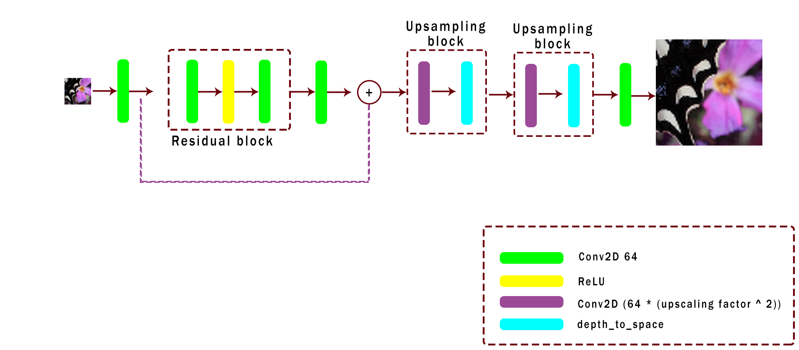
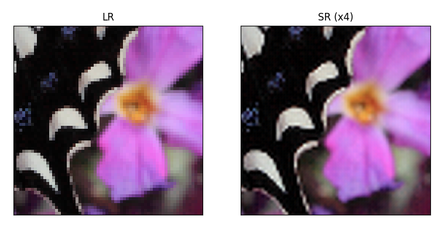
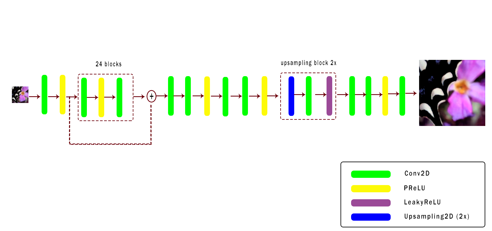
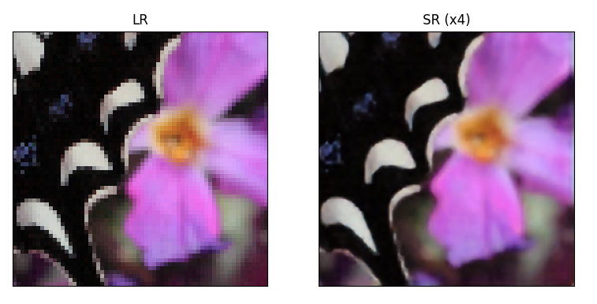
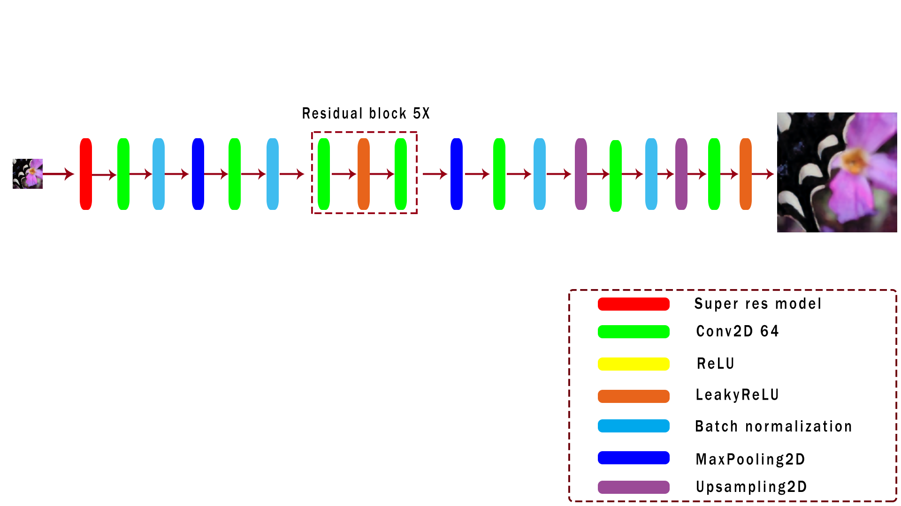
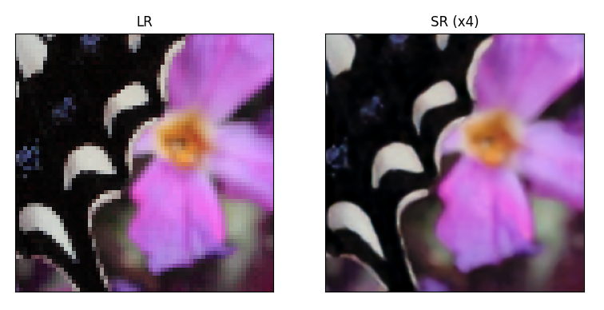

# GeniusAI
## _Single Image Super Resolution Model_

An CNN Model used for enhancing the resolution on images.

- [Features](#Features)
- [Installation](#Installation)
- [References](#References)

## Features

- Enhance a single image resolution 4x
- Load websites faster by loading low res images and using model to enhance

## Installation

Our Model requires Python to run

Download the dependencies with:
```sh
python setup.py
```

To run our program open the terminal use:
```sh
python run.py --lr_path <path> --hr_path <path> --save_path <path>
```
| Parameter | Description |
| ------ | ------ |
| --lr_path | Path where the low-res images are stored |
| --hr_path | Path where the high-res images are stored |
| --save_path | Path where the results are stored |

### EDSR
#### Architecture

#### EDSR Results



### Our model
#### Architecture

#### Out model Results



### Our model + denoiser
#### Architecture

#### Our model + denoiser Results



# Refereces
https://arxiv.org/pdf/1707.02921.pdf
https://arxiv.org/pdf/1907.12904v2.pdf
https://github.com/krasserm/super-resolution
